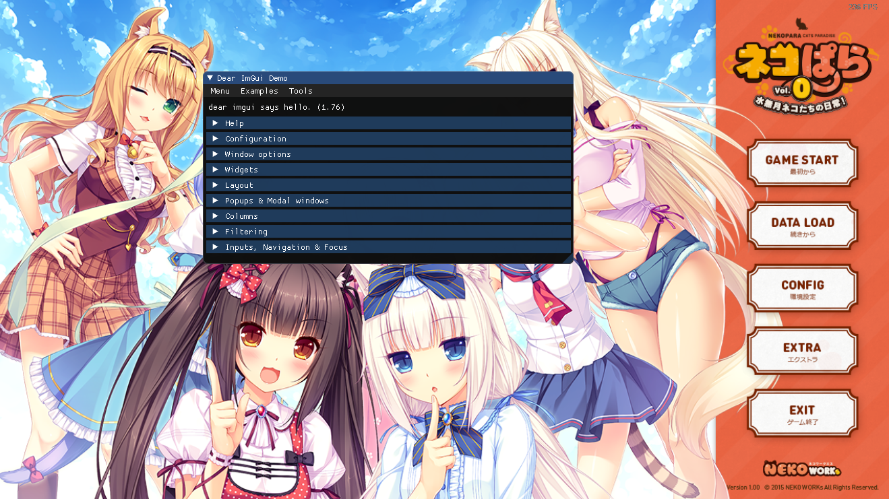

<div align="center">
	<h1>Dear Imgui Hook for Reloaded</h1>
	
	<br/> <br/>
	<strong><i>Making life a bit easier.</i></strong>
	<br/> <br/>
</div>


# Introduction
Reloaded.Imgui.Hook is a simple personal use utility library that can be used to inject Dear Imgui into the current process. 

It is based off of my [minimal changes fork](https://github.com/Sewer56/ImGui.NET) of the great [ImGui.NET](https://github.com/mellinoe/ImGui.NET) library built ontop of [cimgui](https://github.com/cimgui/cimgui).


<div align="center">
	
	<br/> 
	<i>Nekopara 0 by Neko Works</i>
	<br/> <br/>
</div>


## Basic Usage

### Injecting the Overlay

First call `SDK.Init` to initialize all static variables used by the library, then simply call `ImguiHook.Create` with an appropriate delegate. 

```csharp
// During initialization.
SDK.Init(_hooks);
_imguiHook = await ImguiHook.Create(RenderTestWindow);

private void RenderTestWindow()
{
	ImGuiNET.ImGui.ShowDemoWindow();
}
```

The `_hooks` variable is an instance of `IReloadedHooks` from [Reloaded.Hooks](https://github.com/Reloaded-Project/Reloaded.Hooks). In a [Reloaded-II](https://github.com/Reloaded-Project/Reloaded-II) mod, this is part of your mod template. Otherwise, add [Reloaded.Hooks](https://github.com/Reloaded-Project/Reloaded.Hooks) to your project and pass `new ReloadedHooks()` to the method.

### Enabling / Disabling the Overlay

```csharp
// Deactivate
_imguiHook.Disable();

// Activate
_imguiHook.Enable();
```
Leveraging  the capabilities of [Reloaded.Hooks](https://github.com/Reloaded-Project/Reloaded.Hooks), you can even unload your Assembly (DLL) from the process once you disable if you wish.

## Support
- D3D9
- D3D9Ex 
- D3D11

Implemented backends should support window resizing and device resets (fullscreen/windowed switching) etc.

Will implement D3D10 if there's any demand.

### In The Future
- Extensibility. Provide workarounds for possible edge cases such as SRGB colour space.

## Testing
If you would like to try the library, try the test mod for [Reloaded-II](https://github.com/Reloaded-Project/Reloaded-II) available in this repository.

Simply compile `Reloaded.ImGui.TestMod` and add to your Reloaded-II mods directory.

## Contributions
Contributions are very welcome and encouraged; especially given that I'm not really a graphics programmer. I only have some experience in OpenGL 3 as opposed to DirectX 😉. 

Feel free to implement new features, make bug fixes or suggestions so long as they are accompanied by an issue with a clear description of the pull request.